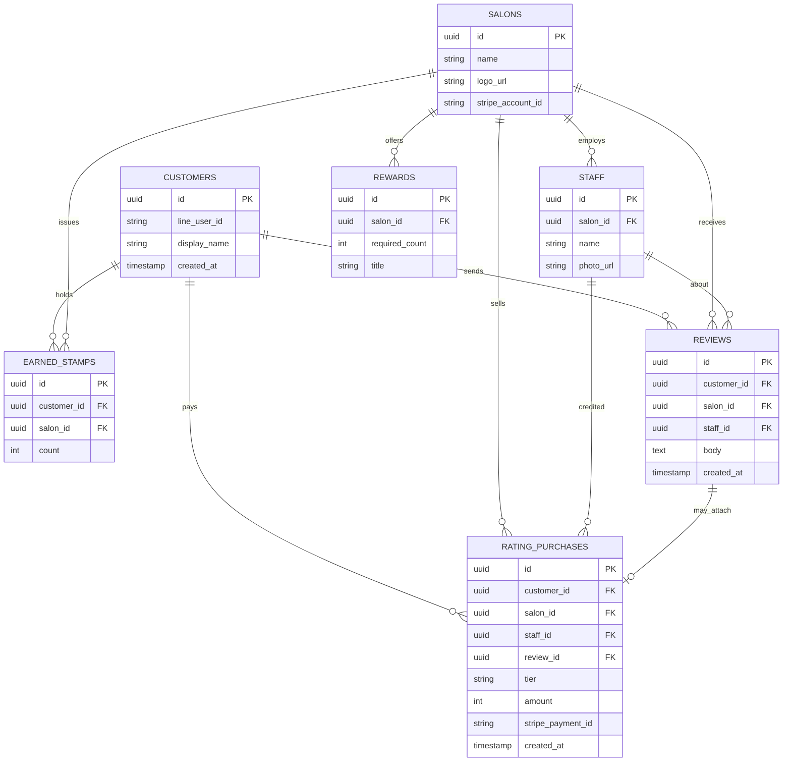

# echo データモデル（ERD）

> MVPの8テーブル。詳細な制約・RLS方針は CLAUDE.md を参照。

## 注意（絶対原則の再掲・詳細はCLAUDE.md）
- RATING_PURCHASES（評価スタンプ・有償）と EARNED_STAMPS（貯まるスタンプ・無償）は別テーブル。統合しない。
- RATING_PURCHASES に残高・チャージ・繰越カラムを作らない（買い切りの記録のみ）。
- EARNED_STAMPS は count のみ。金額に換算しない。
- STAFF は評価対象であって金銭の受取人ではない。
